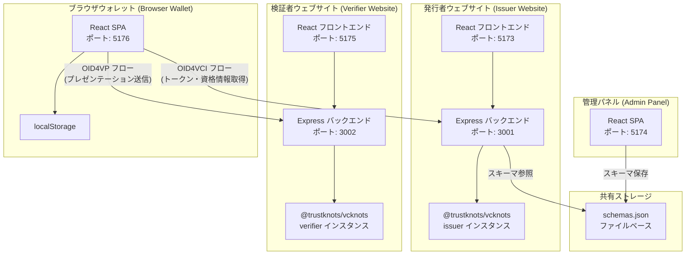
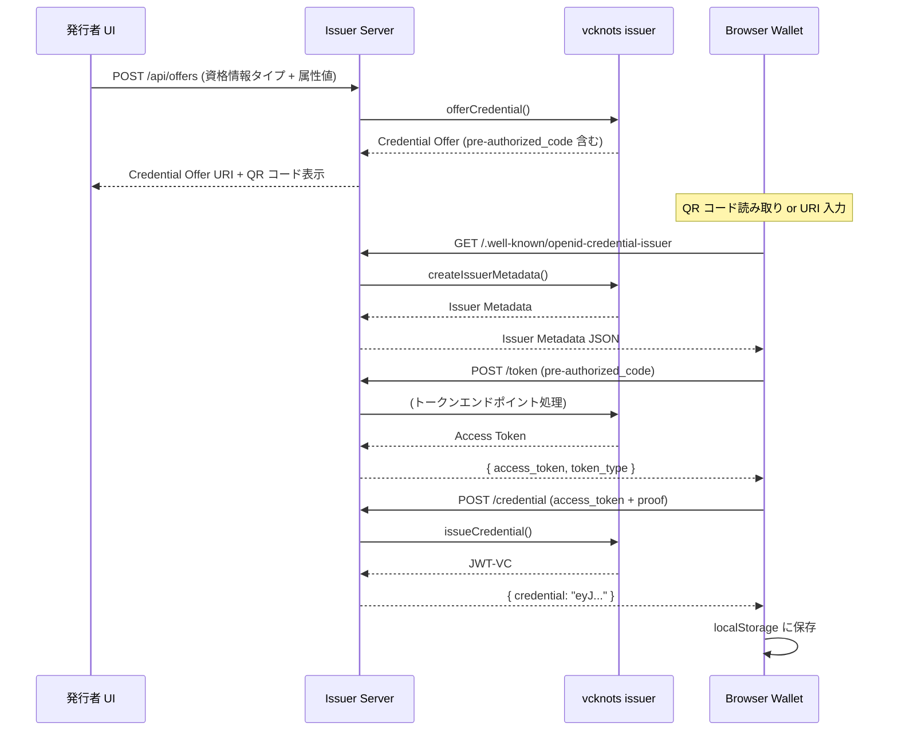
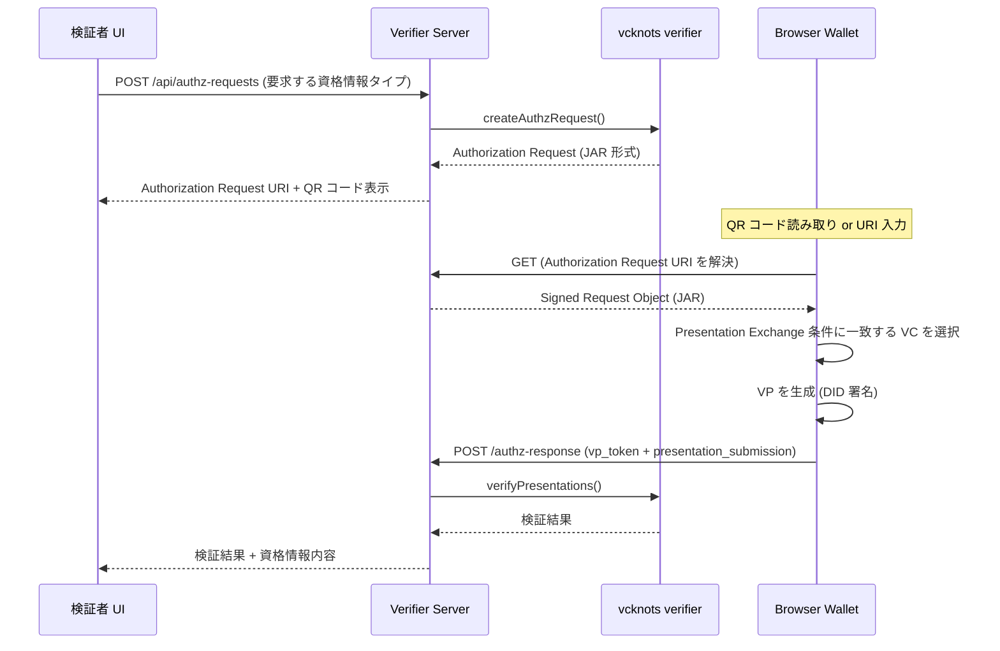

# 設計書: VCknots 検証可能な資格情報エコシステム

## 概要

本設計書は、@trustknots/vcknots ライブラリを基盤とした検証可能な資格情報（Verifiable Credentials）エコシステムの技術設計を定義する。本システムは以下の4つのウェブアプリケーションで構成される：

1. **発行者ウェブサイト（Issuer Website）** — OID4VCI Draft 13 準拠の資格情報発行サーバー
2. **検証者ウェブサイト（Verifier Website）** — OID4VP Draft 24 準拠の資格情報検証サーバー
3. **ブラウザウォレット（Browser Wallet）** — 資格情報の取得・保存・提示を行うクライアントサイドアプリケーション
4. **管理パネル（Admin Panel）** — 資格情報スキーマの定義・管理を行う管理インターフェース

### 技術スタック

| レイヤー | 技術 |
|---------|------|
| ランタイム | Node.js |
| サーバーフレームワーク | Express.js |
| フロントエンド | React + TypeScript |
| ビルドツール | Vite |
| VCコアライブラリ | @trustknots/vcknots |
| QRコード生成 | qrcode.react |
| HTTP クライアント | fetch API (ブラウザ) |
| ストレージ（サーバー） | インメモリ（@trustknots/vcknots デフォルトプロバイダー） |
| ストレージ（ウォレット） | ブラウザ localStorage |
| テストフレームワーク | Vitest + fast-check（プロパティベーステスト） |

### 設計方針

- **プロトタイピング優先**: デフォルトのインメモリプロバイダーを使用し、迅速な開発を実現する
- **プロトコル準拠**: OID4VCI Draft 13 および OID4VP Draft 24 の仕様に厳密に従う
- **モノレポ構成**: 4つのアプリケーションを単一リポジトリで管理し、共有コードを活用する
- **ライブラリ中心設計**: プロトコルロジックは @trustknots/vcknots に委譲し、アプリケーション層はオーケストレーションに集中する

## アーキテクチャ

### システム全体構成



### OID4VCI 発行フロー（Pre-Authorized Code Flow）



### OID4VP 検証フロー



### ディレクトリ構成

```
vcknots_sample/
├── packages/
│   ├── shared/                    # 共有型定義・ユーティリティ
│   │   ├── src/
│   │   │   ├── types/
│   │   │   │   ├── credential-schema.ts
│   │   │   │   ├── activity-log.ts
│   │   │   │   └── index.ts
│   │   │   ├── utils/
│   │   │   │   ├── schema-validator.ts
│   │   │   │   ├── activity-logger.ts
│   │   │   │   └── index.ts
│   │   │   └── index.ts
│   │   ├── package.json
│   │   └── tsconfig.json
│   │
│   ├── issuer/                    # 発行者ウェブサイト
│   │   ├── server/
│   │   │   ├── index.ts           # Express サーバーエントリポイント
│   │   │   ├── vcknots-setup.ts   # vcknots issuer 初期化
│   │   │   ├── routes/
│   │   │   │   ├── well-known.ts  # /.well-known/openid-credential-issuer
│   │   │   │   ├── token.ts       # /token エンドポイント
│   │   │   │   ├── credential.ts  # /credential エンドポイント
│   │   │   │   └── offers.ts      # /api/offers (内部 API)
│   │   │   └── services/
│   │   │       ├── issuer-service.ts
│   │   │       └── schema-service.ts
│   │   ├── client/
│   │   │   ├── src/
│   │   │   │   ├── App.tsx
│   │   │   │   ├── pages/
│   │   │   │   │   ├── IssuePage.tsx
│   │   │   │   │   ├── HistoryPage.tsx
│   │   │   │   │   └── ActivityLogPage.tsx
│   │   │   │   └── components/
│   │   │   │       ├── CredentialForm.tsx
│   │   │   │       ├── QRCodeDisplay.tsx
│   │   │   │       └── IssueStatusTracker.tsx
│   │   │   └── index.html
│   │   ├── package.json
│   │   └── tsconfig.json
│   │
│   ├── verifier/                  # 検証者ウェブサイト
│   │   ├── server/
│   │   │   ├── index.ts
│   │   │   ├── vcknots-setup.ts
│   │   │   ├── routes/
│   │   │   │   ├── well-known.ts
│   │   │   │   ├── authz-request.ts
│   │   │   │   └── authz-response.ts
│   │   │   └── services/
│   │   │       └── verifier-service.ts
│   │   ├── client/
│   │   │   ├── src/
│   │   │   │   ├── App.tsx
│   │   │   │   ├── pages/
│   │   │   │   │   ├── VerifyPage.tsx
│   │   │   │   │   ├── ResultPage.tsx
│   │   │   │   │   └── ActivityLogPage.tsx
│   │   │   │   └── components/
│   │   │   │       ├── VerificationForm.tsx
│   │   │   │       ├── QRCodeDisplay.tsx
│   │   │   │       └── VerifyStatusTracker.tsx
│   │   │   └── index.html
│   │   ├── package.json
│   │   └── tsconfig.json
│   │
│   ├── wallet/                    # ブラウザウォレット
│   │   ├── src/
│   │   │   ├── App.tsx
│   │   │   ├── pages/
│   │   │   │   ├── DashboardPage.tsx
│   │   │   │   ├── ReceiveOfferPage.tsx
│   │   │   │   ├── PresentPage.tsx
│   │   │   │   ├── CredentialDetailPage.tsx
│   │   │   │   └── ActivityLogPage.tsx
│   │   │   ├── components/
│   │   │   │   ├── CredentialList.tsx
│   │   │   │   ├── CredentialCard.tsx
│   │   │   │   ├── OfferConfirmDialog.tsx
│   │   │   │   ├── PresentConfirmDialog.tsx
│   │   │   │   └── DIDDisplay.tsx
│   │   │   ├── services/
│   │   │   │   ├── wallet-service.ts
│   │   │   │   ├── did-service.ts
│   │   │   │   ├── credential-storage.ts
│   │   │   │   └── oid4-client.ts
│   │   │   ├── hooks/
│   │   │   │   ├── useCredentials.ts
│   │   │   │   ├── useDID.ts
│   │   │   │   └── useActivityLog.ts
│   │   │   └── types/
│   │   │       └── wallet.ts
│   │   ├── index.html
│   │   ├── package.json
│   │   └── tsconfig.json
│   │
│   └── admin/                     # 管理パネル
│       ├── src/
│       │   ├── App.tsx
│       │   ├── pages/
│       │   │   ├── SchemaListPage.tsx
│       │   │   └── SchemaEditorPage.tsx
│       │   ├── components/
│       │   │   ├── SchemaForm.tsx
│       │   │   ├── AttributeEditor.tsx
│       │   │   └── SchemaPreview.tsx
│       │   └── services/
│       │       └── schema-storage.ts
│       ├── index.html
│       ├── package.json
│       └── tsconfig.json
│
├── data/
│   └── schemas.json               # 共有スキーマストレージ
├── package.json                    # ルート package.json (workspaces)
├── tsconfig.base.json
└── vitest.config.ts
```

## コンポーネントとインターフェース

### 1. 発行者ウェブサイト（Issuer Website）

#### サーバーサイドコンポーネント

**vcknots-setup.ts** — VCknots ライブラリの初期化

```typescript
// vcknots() を呼び出し、デフォルトのインメモリプロバイダーで issuer を初期化
// did:key メソッドを DID 解決に使用
import { vcknots } from '@trustknots/vcknots';

const { issuer } = vcknots();
export { issuer };
```

**IssuerService** — 発行ロジックのオーケストレーション

```typescript
interface IssuerService {
  // メタデータ生成: issuer.createIssuerMetadata() をラップ
  getMetadata(): Promise<OID4VCIMetadata>;
  
  // オファー生成: issuer.offerCredential() をラップ
  createOffer(credentialType: string, claims: Record<string, unknown>): Promise<CredentialOffer>;
  
  // 資格情報発行: issuer.issueCredential() をラップ
  issueCredential(accessToken: string, proof: object): Promise<string>; // JWT-VC
  
  // トークン発行: Pre-Authorized Code を検証しアクセストークンを返す
  exchangeToken(preAuthorizedCode: string): Promise<TokenResponse>;
}
```

**SchemaService** — スキーマ参照

```typescript
interface SchemaService {
  // 共有ストレージからスキーマを取得
  getSchema(credentialType: string): Promise<CredentialSchema | null>;
  
  // 利用可能なスキーマ一覧を取得
  listSchemas(): Promise<CredentialSchema[]>;
}
```

#### REST API エンドポイント

| メソッド | パス | 説明 | 要件 |
|---------|------|------|------|
| GET | `/.well-known/openid-credential-issuer` | OID4VCI メタデータ | 1.1, 1.2, 1.3 |
| POST | `/token` | トークンエンドポイント | 3.1, 3.4 |
| POST | `/credential` | 資格情報エンドポイント | 3.2, 3.3, 3.5 |
| POST | `/api/offers` | オファー生成（内部 API） | 2.1, 2.2, 2.4, 2.5 |
| GET | `/api/offers/:id` | オファー詳細取得 | 2.3 |
| GET | `/api/history` | 発行履歴一覧 | 15.3 |
| GET | `/api/activity-logs` | アクティビティログ一覧 | 19.10 |

#### エラーレスポンス形式

```typescript
// OID4VCI 標準エラーレスポンス
interface OID4VCIError {
  error: string;        // エラーコード (例: "invalid_grant", "invalid_token")
  error_description?: string;
}
```

### 2. 検証者ウェブサイト（Verifier Website）

#### サーバーサイドコンポーネント

**VerifierService** — 検証ロジックのオーケストレーション

```typescript
interface VerifierService {
  // メタデータ生成: verifier.createVerifierMetadata() をラップ
  getMetadata(): Promise<OID4VPMetadata>;
  
  // 認可リクエスト生成: verifier.createAuthzRequest() をラップ
  createAuthzRequest(credentialType: string): Promise<AuthorizationRequest>;
  
  // プレゼンテーション検証: verifier.verifyPresentations() をラップ
  verifyPresentation(vpToken: string, presentationSubmission: object): Promise<VerificationResult>;
}
```

#### REST API エンドポイント

| メソッド | パス | 説明 | 要件 |
|---------|------|------|------|
| GET | `/.well-known/openid-verifier` | OID4VP メタデータ | 4.1, 4.2 |
| POST | `/api/authz-requests` | 認可リクエスト生成 | 5.1, 5.2, 5.3 |
| GET | `/api/authz-requests/:id` | 認可リクエスト取得 | 5.4 |
| POST | `/authz-response` | プレゼンテーション受信・検証 | 6.1-6.6 |
| GET | `/api/activity-logs` | アクティビティログ一覧 | 19.12 |

### 3. ブラウザウォレット（Browser Wallet）

#### サービスコンポーネント

**DIDService** — DID の生成と管理

```typescript
interface DIDService {
  // did:key メソッドで DID と鍵ペアを生成
  generateDID(): Promise<{ did: string; keyPair: CryptoKeyPair }>;
  
  // localStorage から DID を取得（存在しない場合は生成）
  getOrCreateDID(): Promise<{ did: string; keyPair: CryptoKeyPair }>;
  
  // DID の存在確認
  hasDID(): boolean;
}
```

**CredentialStorage** — 資格情報の永続化

```typescript
interface CredentialStorage {
  // 資格情報を localStorage に保存
  save(credential: StoredCredential): void;
  
  // 全資格情報を取得
  getAll(): StoredCredential[];
  
  // ID で資格情報を取得
  getById(id: string): StoredCredential | null;
  
  // 資格情報を削除
  delete(id: string): void;
  
  // Presentation Exchange 条件に一致する資格情報を検索
  findMatching(presentationDefinition: PresentationDefinition): StoredCredential[];
}
```

**OID4Client** — OID4VCI/OID4VP クライアントロジック

```typescript
interface OID4Client {
  // Credential Offer URI を解析
  parseCredentialOffer(uri: string): Promise<ParsedCredentialOffer>;
  
  // 発行者メタデータを取得
  fetchIssuerMetadata(issuerUrl: string): Promise<OID4VCIMetadata>;
  
  // Pre-Authorized Code Flow でトークンを取得
  exchangePreAuthorizedCode(tokenEndpoint: string, code: string): Promise<TokenResponse>;
  
  // 資格情報を取得
  fetchCredential(credentialEndpoint: string, accessToken: string, proof: object): Promise<string>;
  
  // 認可リクエストを解析
  parseAuthorizationRequest(uri: string): Promise<ParsedAuthzRequest>;
  
  // Verifiable Presentation を生成して送信
  submitPresentation(
    responseUri: string,
    credentials: StoredCredential[],
    did: string,
    keyPair: CryptoKeyPair,
    nonce: string
  ): Promise<void>;
}
```

**WalletService** — ウォレット操作の統合

```typescript
interface WalletService {
  // 資格情報オファーの受信と処理
  receiveOffer(offerUri: string): Promise<ParsedCredentialOffer>;
  
  // オファーの受け入れと資格情報取得
  acceptOffer(offer: ParsedCredentialOffer): Promise<StoredCredential>;
  
  // 認可リクエストの受信と処理
  receiveAuthzRequest(requestUri: string): Promise<ParsedAuthzRequest>;
  
  // 資格情報の提示
  presentCredentials(
    request: ParsedAuthzRequest,
    selectedCredentials: StoredCredential[]
  ): Promise<void>;
}
```

### 4. 管理パネル（Admin Panel）

#### サービスコンポーネント

**SchemaStorage** — スキーマの永続化（ファイルベース）

```typescript
interface SchemaStorage {
  // スキーマを保存（data/schemas.json に書き込み）
  save(schema: CredentialSchema): Promise<void>;
  
  // 全スキーマを取得
  getAll(): Promise<CredentialSchema[]>;
  
  // ID でスキーマを取得
  getById(id: string): Promise<CredentialSchema | null>;
  
  // スキーマを更新
  update(id: string, schema: CredentialSchema): Promise<void>;
  
  // スキーマを削除
  delete(id: string): Promise<void>;
}
```

### 5. 共有コンポーネント

#### ActivityLogger — アクティビティログ記録

```typescript
interface ActivityLogger {
  // ログエントリを記録
  log(entry: ActivityLogEntry): void;
  
  // ログ一覧を取得（時系列降順）
  getLogs(): ActivityLogEntry[];
  
  // ログをクリア
  clear(): void;
}
```

#### SchemaValidator — スキーマバリデーション

```typescript
interface SchemaValidator {
  // スキーマの妥当性を検証
  validate(schema: CredentialSchema): ValidationResult;
  
  // 資格情報の属性値がスキーマに適合するか検証
  validateClaims(claims: Record<string, unknown>, schema: CredentialSchema): ValidationResult;
}
```

## データモデル

### CredentialSchema（資格情報スキーマ）

```typescript
interface CredentialSchema {
  id: string;                          // UUID
  name: string;                        // スキーマ名（例: "UniversityDegree"）
  version: string;                     // バージョン（例: "1.0"）
  attributes: SchemaAttribute[];       // 属性定義の配列
  createdAt: string;                   // ISO 8601 タイムスタンプ
  updatedAt: string;                   // ISO 8601 タイムスタンプ
}

interface SchemaAttribute {
  name: string;                        // 属性名（例: "degree", "gpa"）
  type: 'string' | 'number' | 'date' | 'boolean';  // 属性の型
  required: boolean;                   // 必須フラグ
  description?: string;                // 属性の説明
}
```

### StoredCredential（保存済み資格情報）

```typescript
interface StoredCredential {
  id: string;                          // UUID（ウォレット内部 ID）
  rawJwt: string;                      // JWT-VC の生データ
  decoded: DecodedCredential;          // デコード済みの資格情報内容
  issuerUrl: string;                   // 発行者の URL
  receivedAt: string;                  // 受信日時（ISO 8601）
}

interface DecodedCredential {
  issuer: string;                      // 発行者 DID
  type: string[];                      // 資格情報タイプ（例: ["VerifiableCredential", "UniversityDegree"]）
  credentialSubject: Record<string, unknown>;  // 資格情報の属性値
  issuanceDate: string;                // 発行日（ISO 8601）
  expirationDate?: string;            // 有効期限（ISO 8601、オプション）
}
```

### ActivityLogEntry（アクティビティログエントリ）

```typescript
interface ActivityLogEntry {
  id: string;                          // UUID
  timestamp: string;                   // ISO 8601 タイムスタンプ
  component: 'issuer' | 'verifier' | 'wallet';  // コンポーネント種別
  action: ActivityAction;              // 操作種別
  status: 'success' | 'failure';       // 操作結果
  details: Record<string, unknown>;    // 操作の詳細情報
  errorReason?: string;                // エラー理由（失敗時のみ）
}

type ActivityAction =
  | 'offer_created'           // 資格情報オファー作成（発行者）
  | 'credential_issued'       // 資格情報発行完了（発行者）
  | 'issuance_failed'         // 発行処理失敗（発行者）
  | 'offer_received'          // オファー受信（ウォレット）
  | 'credential_acquired'     // 資格情報取得完了（ウォレット）
  | 'presentation_submitted'  // プレゼンテーション提出（ウォレット）
  | 'authz_request_created'   // 認可リクエスト作成（検証者）
  | 'presentation_received'   // プレゼンテーション受信（検証者）
  | 'verification_completed'; // 検証完了（検証者）
```

### CredentialOffer（資格情報オファー）

```typescript
interface CredentialOffer {
  credential_issuer: string;           // 発行者 URL
  credential_configuration_ids: string[];  // 資格情報設定 ID
  grants: {
    'urn:ietf:params:oauth:grant-type:pre-authorized_code': {
      'pre-authorized_code': string;   // Pre-Authorized Code
    };
  };
}
```

### ParsedCredentialOffer（解析済みオファー）

```typescript
interface ParsedCredentialOffer {
  issuerUrl: string;                   // 発行者 URL
  credentialType: string;              // 資格情報タイプ
  preAuthorizedCode: string;           // Pre-Authorized Code
  issuerMetadata: OID4VCIMetadata;     // 発行者メタデータ
}
```

### TokenResponse（トークンレスポンス）

```typescript
interface TokenResponse {
  access_token: string;
  token_type: 'Bearer';
  expires_in?: number;
}
```

### ParsedAuthzRequest（解析済み認可リクエスト）

```typescript
interface ParsedAuthzRequest {
  verifierUrl: string;                 // 検証者 URL
  responseUri: string;                 // レスポンス送信先 URI
  nonce: string;                       // ノンス
  presentationDefinition: PresentationDefinition;  // 要求条件
  matchingCredentials: StoredCredential[];  // 一致する保存済み資格情報
}

interface PresentationDefinition {
  id: string;
  input_descriptors: InputDescriptor[];
}

interface InputDescriptor {
  id: string;
  name?: string;
  purpose?: string;
  constraints: {
    fields: FieldConstraint[];
  };
}

interface FieldConstraint {
  path: string[];                      // JSONPath（例: ["$.type"]）
  filter?: {
    type: string;
    pattern?: string;
    contains?: { const: string };
  };
}
```

### ValidationResult（バリデーション結果）

```typescript
interface ValidationResult {
  valid: boolean;
  errors: ValidationError[];
}

interface ValidationError {
  field: string;                       // エラーが発生したフィールド名
  message: string;                     // エラーメッセージ
}
```

### VerificationResult（検証結果）

```typescript
interface VerificationResult {
  verified: boolean;                   // 検証成功フラグ
  credentials: VerifiedCredential[];   // 検証済み資格情報
  errors?: string[];                   // エラーメッセージ（失敗時）
}

interface VerifiedCredential {
  type: string[];
  issuer: string;
  credentialSubject: Record<string, unknown>;
  issuanceDate: string;
}
```


## 正当性プロパティ（Correctness Properties）

*プロパティとは、システムのすべての有効な実行において真であるべき特性や振る舞いのことである。プロパティは、人間が読める仕様と機械的に検証可能な正当性保証の橋渡しとなる。*

以下のプロパティは、要件定義書の受け入れ基準から導出された、プロパティベーステストで検証可能な普遍的性質である。

### Property 1: Pre-Authorized Code の一意性

*任意の* 2つの Credential Offer に対して、それぞれに含まれる Pre-Authorized Code は異なる値でなければならない。

**Validates: Requirements 2.4**

### Property 2: 未定義の資格情報タイプの拒否

*任意の* 文字列が Admin_Panel で定義されたスキーマ名のいずれにも一致しない場合、その文字列を資格情報タイプとして指定したオファー生成リクエストはエラーで拒否され、オファーは生成されない。

**Validates: Requirements 2.5**

### Property 3: 有効な Pre-Authorized Code によるトークン取得

*任意の* 有効な Pre-Authorized Code に対して、トークンエンドポイントは `access_token` と `token_type: "Bearer"` を含む有効なトークンレスポンスを返す。

**Validates: Requirements 3.1**

### Property 4: 発行済み資格情報の DID ベース発行者識別子

*任意の* 発行された JWT-VC に対して、デコードされた資格情報の `issuer` フィールドは有効な DID 形式（`did:` プレフィックスで始まる）でなければならない。

**Validates: Requirements 3.3**

### Property 5: 無効な Pre-Authorized Code のエラーレスポンス

*任意の* 有効な Pre-Authorized Code ではない文字列に対して、トークンエンドポイントは HTTP 400 ステータスコードと `invalid_grant` エラーコードを含むレスポンスを返す。

**Validates: Requirements 3.4**

### Property 6: 無効なアクセストークンのエラーレスポンス

*任意の* 有効なアクセストークンではない文字列に対して、資格情報エンドポイントは HTTP 401 ステータスコードと `invalid_token` エラーコードを含むレスポンスを返す。

**Validates: Requirements 3.5**

### Property 7: Credential Offer URI の解析正当性

*任意の* 有効な Credential Offer URI に対して、解析処理は発行者 URL、資格情報タイプ、および Pre-Authorized Code を正しく抽出する。

**Validates: Requirements 7.1**

### Property 8: 不正な Credential Offer URI のエラー処理

*任意の* 有効な Credential Offer URI の形式に適合しない文字列に対して、解析処理はエラーを返し、正常な ParsedCredentialOffer を生成しない。

**Validates: Requirements 7.4**

### Property 9: 資格情報ストレージのラウンドトリップ

*任意の* 有効な StoredCredential に対して、localStorage に保存した後に読み込むと、元の資格情報と等価なオブジェクトが得られる。

**Validates: Requirements 8.3**

### Property 10: 認可リクエスト URI の解析正当性

*任意の* 有効な認可リクエスト URI に対して、解析処理は検証者 URL、レスポンス URI、ノンス、および Presentation Definition を正しく抽出する。

**Validates: Requirements 9.1**

### Property 11: Presentation Exchange 条件に基づく資格情報マッチング

*任意の* 保存済み資格情報のセットと *任意の* Presentation Definition に対して、`findMatching` が返すすべての資格情報は、Presentation Definition の input_descriptors の制約条件を満たす。また、返されなかった資格情報は制約条件を満たさない。

**Validates: Requirements 9.2**

### Property 12: DID のストレージと再利用の冪等性

*任意の* DID と鍵ペアに対して、localStorage に保存した後に `getOrCreateDID()` を複数回呼び出しても、常に同一の DID が返される。新しい DID は生成されない。

**Validates: Requirements 11.2, 11.4**

### Property 13: スキーマストレージのラウンドトリップ

*任意の* 有効な CredentialSchema に対して、共有ストレージに保存した後に読み込むと、元のスキーマと等価なオブジェクトが得られる。

**Validates: Requirements 12.3**

### Property 14: スキーマバリデーションによる不正属性の拒否

*任意の* CredentialSchema において、属性名が空文字列であるか、または2つ以上の属性が同一の名前を持つ場合、バリデーションは失敗し、保存は中止される。

**Validates: Requirements 12.6**

### Property 15: 発行フローにおけるクレーム値の保存

*任意の* 有効なクレーム値のセットに対して、発行フロー（オファー生成 → トークン取得 → 資格情報発行 → ウォレット保存）を完了した後、ウォレットに保存された資格情報の `credentialSubject` は、発行者が入力した元のクレーム値と一致する。

**Validates: Requirements 17.2**

### Property 16: 発行者アクティビティログの完全性

*任意の* 発行者操作（オファー作成、資格情報発行、発行失敗）に対して、操作完了後のアクティビティログには、タイムスタンプ、操作種別、および操作結果を含むエントリが記録される。失敗の場合はエラー理由も含まれる。

**Validates: Requirements 19.1, 19.2, 19.3**

### Property 17: ウォレットアクティビティログの完全性

*任意の* ウォレット操作（オファー受信、資格情報取得、プレゼンテーション提出）に対して、操作完了後のアクティビティログには、タイムスタンプ、操作種別、および関連情報（発行者情報または検証者情報）を含むエントリが記録される。

**Validates: Requirements 19.4, 19.5, 19.6**

### Property 18: 検証者アクティビティログの完全性

*任意の* 検証者操作（認可リクエスト作成、プレゼンテーション受信、検証完了）に対して、操作完了後のアクティビティログには、タイムスタンプ、操作種別、および操作結果を含むエントリが記録される。検証失敗の場合は失敗理由も含まれる。

**Validates: Requirements 19.7, 19.8, 19.9**

## エラーハンドリング

### エラー分類と対応方針

本システムのエラーは以下の3つのカテゴリに分類される：

#### 1. プロトコルエラー（OID4VCI / OID4VP 準拠）

| エラー状況 | HTTP ステータス | エラーコード | 対応コンポーネント | 要件 |
|-----------|---------------|-------------|------------------|------|
| 無効な Pre-Authorized Code | 400 | `invalid_grant` | Issuer Server | 3.4 |
| 無効・期限切れアクセストークン | 401 | `invalid_token` | Issuer Server | 3.5 |
| メタデータ生成失敗 | 500 | `server_error` | Issuer / Verifier Server | 1.4, 4.3 |
| 認可リクエスト生成失敗 | 500 | `server_error` | Verifier Server | 5.5 |

プロトコルエラーは OID4VCI / OID4VP 仕様に定義されたエラーレスポンス形式に従う：

```typescript
// レスポンスボディ
{
  "error": "invalid_grant",
  "error_description": "The pre-authorized code is invalid or has expired."
}
```

#### 2. アプリケーションエラー

| エラー状況 | 対応 | 対応コンポーネント | 要件 |
|-----------|------|------------------|------|
| 未定義の資格情報タイプ | エラーメッセージ表示、処理中止 | Issuer Website | 2.5 |
| 参照スキーマ不存在 | エラーログ記録、発行中止 | Issuer Website | 13.4 |
| スキーマバリデーション失敗 | バリデーションエラー表示、保存中止 | Admin Panel | 12.6 |
| 不正な Credential Offer URI | エラーメッセージ表示 | Browser Wallet | 7.4 |
| 一致する資格情報なし | メッセージ表示 | Browser Wallet | 9.5 |

#### 3. ネットワークエラー

| エラー状況 | 対応 | 対応コンポーネント | 要件 |
|-----------|------|------------------|------|
| 発行フロー中のネットワークエラー | エラーメッセージ + 再試行オプション | Browser Wallet | 17.3 |
| 検証フロー中のネットワークエラー | エラーメッセージ + 再試行オプション | Browser Wallet | 18.3 |
| メタデータ取得失敗 | エラーメッセージ表示 | Browser Wallet | 7.2 |

### エラーハンドリング実装方針

**サーバーサイド（Issuer / Verifier）:**
- Express のエラーハンドリングミドルウェアで統一的にエラーを処理
- vcknots ライブラリからの例外をキャッチし、適切な HTTP ステータスコードとエラーレスポンスに変換
- すべてのエラーをアクティビティログに記録

**クライアントサイド（Wallet / Admin）:**
- try-catch で HTTP リクエストのエラーをキャッチ
- ユーザーフレンドリーなエラーメッセージを表示
- ネットワークエラーの場合は再試行オプションを提供
- エラー発生時もアクティビティログに記録

```typescript
// サーバーサイドのエラーハンドリングミドルウェア例
function errorHandler(err: Error, req: Request, res: Response, next: NextFunction) {
  activityLogger.log({
    id: generateId(),
    timestamp: new Date().toISOString(),
    component: 'issuer', // or 'verifier'
    action: determineAction(req),
    status: 'failure',
    details: { path: req.path, method: req.method },
    errorReason: err.message,
  });

  if (err instanceof OID4VCIError) {
    return res.status(err.statusCode).json({
      error: err.errorCode,
      error_description: err.message,
    });
  }

  return res.status(500).json({
    error: 'server_error',
    error_description: 'An unexpected error occurred.',
  });
}
```

## テスト戦略

### テストアプローチ

本プロジェクトでは、以下の3層のテストアプローチを採用する：

#### 1. プロパティベーステスト（Property-Based Tests）

**ライブラリ**: Vitest + [fast-check](https://github.com/dubzzz/fast-check)

プロパティベーステストは、設計書の正当性プロパティ（Property 1〜18）を検証する。各テストは最低100回のイテレーションで実行される。

**対象領域:**
- URI 解析ロジック（Property 7, 8, 10）
- ストレージのラウンドトリップ（Property 9, 12, 13）
- バリデーションロジック（Property 2, 5, 6, 14）
- 資格情報マッチングロジック（Property 11）
- アクティビティログの完全性（Property 16, 17, 18）
- トークン・資格情報発行の不変条件（Property 1, 3, 4）
- エンドツーエンドのデータ保存（Property 15）

**設定:**
- 各テストは最低100回のイテレーション
- 各テストにはプロパティ番号を参照するタグコメントを付与
- タグ形式: `Feature: vcknots-verifiable-credentials, Property {number}: {property_text}`

```typescript
// プロパティベーステストの例
import { fc } from 'fast-check';
import { describe, it, expect } from 'vitest';

describe('CredentialStorage', () => {
  // Feature: vcknots-verifiable-credentials, Property 9: 資格情報ストレージのラウンドトリップ
  it('should preserve credential data through save/load cycle', () => {
    fc.assert(
      fc.property(
        arbitraryStoredCredential(),
        (credential) => {
          storage.save(credential);
          const loaded = storage.getById(credential.id);
          expect(loaded).toEqual(credential);
        }
      ),
      { numRuns: 100 }
    );
  });
});
```

#### 2. ユニットテスト（Unit Tests）

**ライブラリ**: Vitest

ユニットテストは、具体的な例やエッジケースを検証する。プロパティベーステストが入力空間全体をカバーするため、ユニットテストは以下に集中する：

**対象領域:**
- UI コンポーネントのレンダリング（要件 10, 15, 16 の UI 要件）
- 特定のエッジケース（空の資格情報リスト、メタデータ生成失敗など）
- OID4VCI/OID4VP プロトコルの具体的なレスポンス形式
- エラーメッセージの内容検証

#### 3. インテグレーションテスト（Integration Tests）

**ライブラリ**: Vitest + supertest（HTTP テスト）

インテグレーションテストは、コンポーネント間の連携を検証する：

**対象領域:**
- 発行者サーバーの REST API エンドポイント（要件 1, 2, 3）
- 検証者サーバーの REST API エンドポイント（要件 4, 5, 6）
- Admin Panel とIssuer Website 間のスキーマ共有（要件 13）
- エンドツーエンドの発行フロー（要件 17）
- エンドツーエンドの検証フロー（要件 18）

### テストディレクトリ構成

```
packages/
├── shared/
│   └── src/
│       └── __tests__/
│           ├── schema-validator.test.ts      # Property 14
│           ├── schema-validator.prop.test.ts  # Property 13, 14
│           └── activity-logger.test.ts        # Property 16, 17, 18
├── issuer/
│   └── server/
│       └── __tests__/
│           ├── token.test.ts                  # Property 3, 5
│           ├── credential.test.ts             # Property 4, 6
│           ├── offers.test.ts                 # Property 1, 2
│           └── issuer-service.prop.test.ts    # Property 1, 2, 3, 4, 5, 6
├── verifier/
│   └── server/
│       └── __tests__/
│           └── verifier-service.test.ts       # Integration tests
├── wallet/
│   └── src/
│       └── __tests__/
│           ├── credential-storage.prop.test.ts # Property 9
│           ├── did-service.prop.test.ts        # Property 12
│           ├── oid4-client.prop.test.ts        # Property 7, 8, 10
│           ├── wallet-service.prop.test.ts     # Property 11, 15
│           └── wallet-service.test.ts          # Integration tests
└── admin/
    └── src/
        └── __tests__/
            └── schema-storage.prop.test.ts     # Property 13
```

### テストカバレッジ目標

| テスト種別 | カバレッジ目標 | 備考 |
|-----------|-------------|------|
| プロパティベーステスト | 全18プロパティ | 各100回以上のイテレーション |
| ユニットテスト | 主要コンポーネント80%以上 | UI コンポーネント含む |
| インテグレーションテスト | 全 REST API エンドポイント | エンドツーエンドフロー含む |
